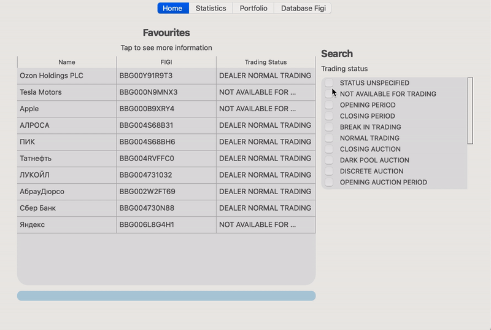
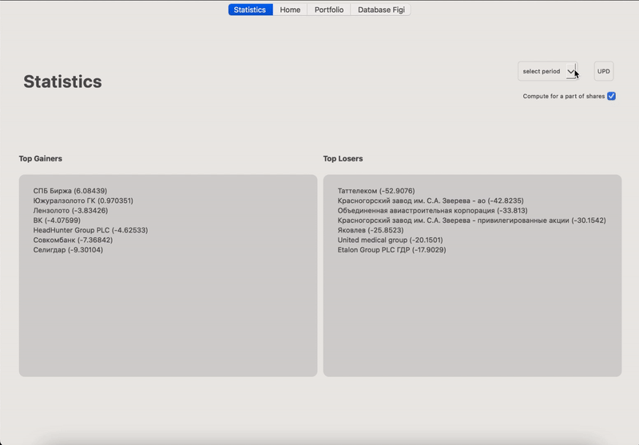
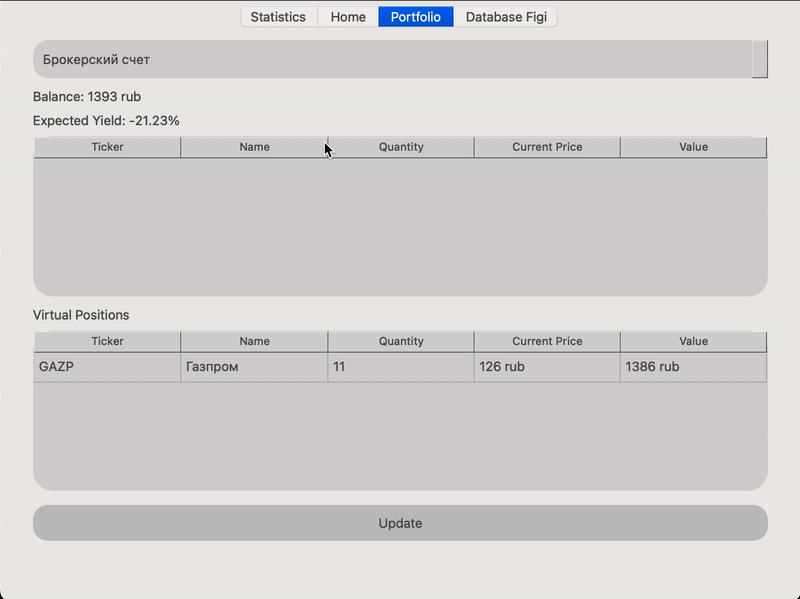
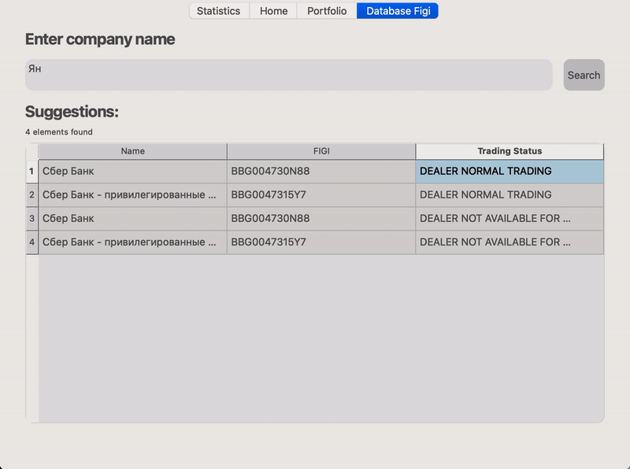

# Invest Manager Desktop Application

InvestManager is a comprehensive desktop application which is designed to help investors of all levels with the tools and insights they may need to navigate the world of financial markets. Built upon the robust foundation of C++, leveraging the Tinkoff Invest API for seamless market access, and adorned with an intuitive Qt-based user interface, InvestManager offers a streamlined and efficient approach to managing your investment portfolio.

## 📝 Features

1) Portfolio management:
   * Effortlessly track and manage your shares and bonds in a centralized location.
   * Analyze historical data and visualize trends on the market.
  
2) Market exploration:
    * Access comprehensive market data and historical charts.
    * Explore and discover new investment opportunities through advanced search and filtering.
  

3) User-Friendly Interface:
    * Navigate effortlessly through the application with a clean and intuitive Qt-based interface.

## 💻 Technologies

| Component     |Role              |
|----------------------|-----------------------------------------------------------------------------------|
| C++                  | Ensuring high performance and efficiency.                                         |
| Tinkoff Invest API   | Providing secure and reliable access to market data and trading functionality.    |
| Qt                   | Delivering a modern and user-friendly interface.                                  |

 

## 🔎 Detailed Overview 

 Homepage

  

> **Description**
>
> This page displays all favourite shares and gives a possibility to filter them by trading status. By clicking on one particular share, it is possible to see a detailed graph with historical candles over selected period
>   
>  

 Statistics page

  

> **Description**
>
>
> This page displays top most profitable and non-profitable shares over selected period. Options: 
> * 1 day
> * 1 week
> * 1 month
> 
> In order to compute the result, application makes a lot of requests to the server to get all neccessary data, so computation may take some time, especially if the network connection is unstable. In order to see demonstration of this functionality quickly, one may set combo box to active mode.  
>
> 

 Portfolio

  

> **Description**
>
>
> This page displays information about portfolio of the user. It is possible to switch between accounts and update information in real time.
>   
> 

 Database Figi

  

> **Description**
>
>
> This page ensures quick access to the unique figi of a particular share and helps to instantly check its trading status.
>   
> 

  

## ❗️  Prerequisites 

 Install this to use the app

  

 

## 📖 Documentation 
link to documentation: ``https://pelancha.github.io/index.html``

